# Credit Risk Analysis

## Overiew of Project

### Purpose

The purpose of this project is to use the `scikit-learn` and `imblearn` Python libraries to create predictive models of credit loan risks. Multiple methods will be used to create models. Analyses will follow each one, which will show a accuracy score, a confusion matrix, and a classification report. 

### Project Code

The code that performed the model trainings and analyzed their efficacy can be found in the following Jupyter Notebooks:
- [credist_risk_resampling](./credit_risk_resampling.ipynb)
- [credist_risk_ensemble](./credit_risk_ensemble.ipynb)

### Data Preparation

The data preparation consisted of the following:

1. Data imported to `Pandas` data frame object
2. Filter out unwanted columns of data 
3. Drop null columns where all values are null
4. Drop null rows
5. Remove rows with "Issued" value in `loan_status` column
6. Clean up numerical strings and convert to float
7. Convert certain values from the `loan_status` column to either **low_risk** or **high_risk**
8. Use convert columns with **object** type values to integer boolean (0 or 1) columns with the `pd.get_dummies()` function
9. Scale the independent variables using the `StandardScaler` class object from `sklearn.preprocessing`

## Results

### RandomOverSampler

#### Description

The RandomOverSampler is an **over sampling** method which increases the minority class by picking duplicate samples of that class at random. 
#### Accuracy Score
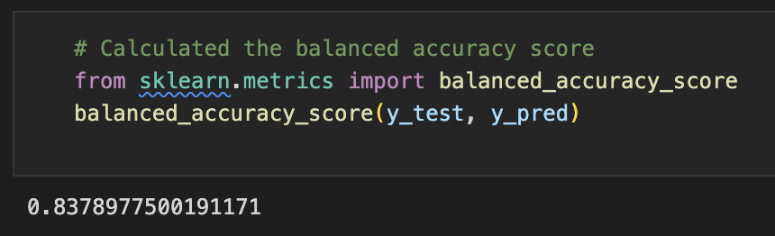
- The accuracy score is (0.8378977500191171)

#### Confusion Matrix

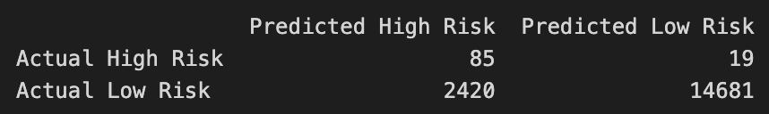

#### Classification Report
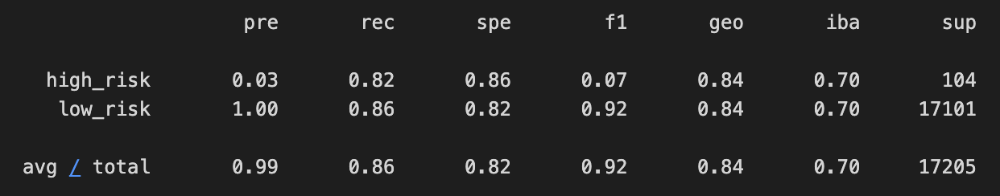
- Precision Score: 
  - `high_risk` = 0.03
  - `low_risk` = 1.00
- Recall Score: 
  - `high_risk` = 0.82
  - `low_risk` = 0.86

### SMOTE

#### Description

**Synthetic Minority Oversampling Technique**, or **SMOTE** for short, is an **over sampling** method which synthesizes additional minority samples based off existing minority samples to combat data imbalances.

#### Accuracy Score
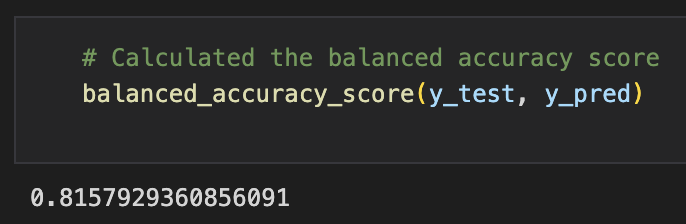
- The accuracy score is (0.8157929360856091)

#### Confusion Matrix

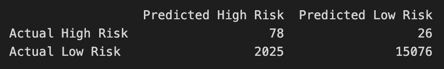

#### Classification Report
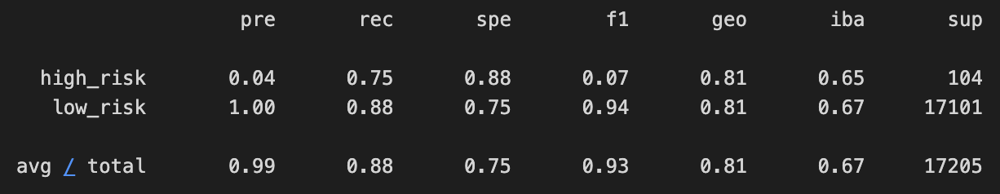
- Precision Score: 
  - `high_risk` = 0.04
  - `low_risk` = 1.00
- Recall Score: 
  - `high_risk` = 0.75
  - `low_risk` = 0.88

### ClusterCentroids
#### Description

ClusterCentroids is an **under sampling** method which reduces clusters of majority samples based off of centroids generated from those clusters.
#### Accuracy Score
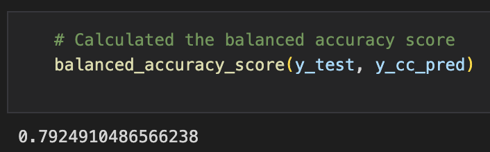
- The accuracy score is (0.7924910486566238)

#### Confusion Matrix

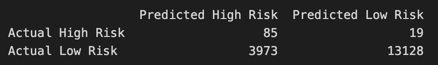

#### Classification Report
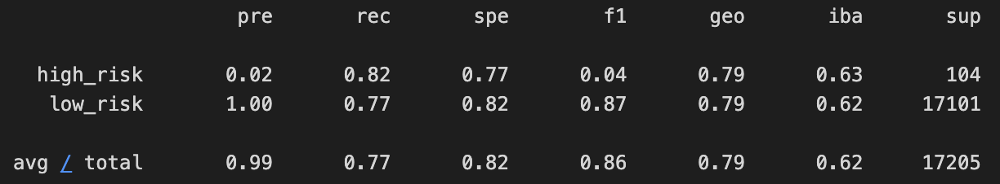
- Precision Score: 
  - `high_risk` = 0.02
  - `low_risk` = 1.00

- Recall Score: 
  - `high_risk` = 0.82
  - `low_risk` = 0.77

### SMOTEENN
#### Description

SMOTEENN is a combination of over and under sampling. The over sampling is the same as the above-mentioned SMOTE. The under sampling method being used is **Edited Nearest Neighbour**, or **ENN** for short. ENN is a method of removing majority samples based on nearest neighbor minority samples.

#### Accuracy Score
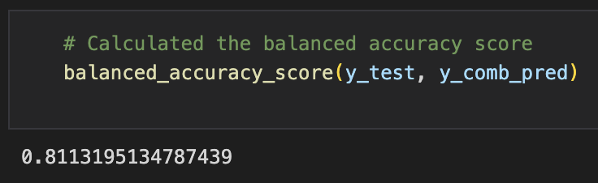
- The accuracy score is (0.8113195134787439)

#### Confusion Matrix

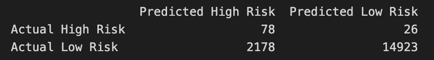

#### Classification Report
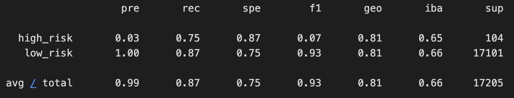
- Precision Score: 
  - `high_risk` = 0.03
  - `low_risk` = 1.00
- Recall Score: 
  - `high_risk` = 0.75
  - `low_risk` = 0.87

### BalancedRandomForestClassifier
#### Description

BalancedRandomForestClassifier is a **Random Forest Classifier** which under samples each bootstrap randomly.

#### Accuracy Score
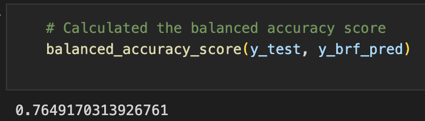
- The accuracy score is (0.7649170313926761)

#### Confusion Matrix

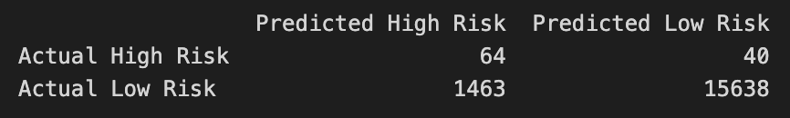

#### Classification Report
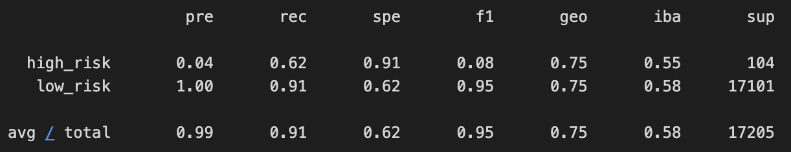
- Precision Score: 
  - `high_risk` = 0.04
  - `low_risk` = 1.00
- Recall Score: 
  - `high_risk` = 0.62
  - `low_risk` = 0.91

### EasyEnsembleClassifier
#### Description

EasyEnsembleClassifier is an ensemble of **Adaptive Boosting** machine learning techniques, of which are trained on multiple balanced bootstrap samples. A random under sampling method is used to create those balanced samples.
#### Accuracy Score
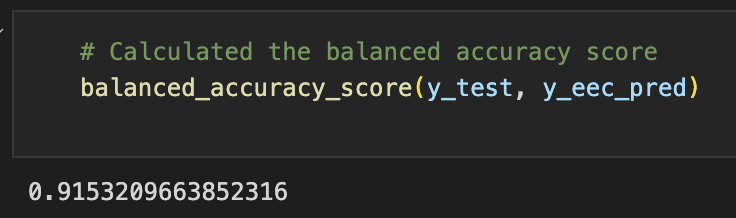
- The accuracy score is (0.9153209663852316)

#### Confusion Matrix

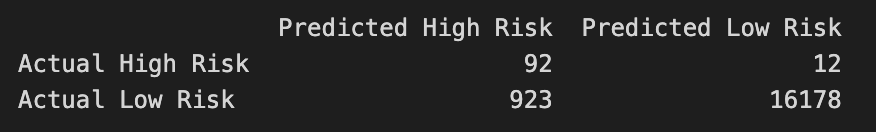

#### Classification Report
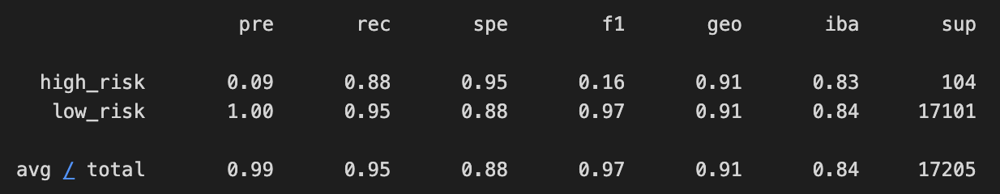
- Precision Score: 
  - `high_risk` = 0.09
  - `low_risk` = 1.00
- Recall Score: 
  - `high_risk` = 0.88
  - `low_risk` = 0.95

## Summary

### Best Scores

#### Accuracy

- **Winner**: EasyEnsembleClassifier (0.9153209663852316)
- **Loser**: BalancedRandomForestClassifier (0.7649170313926761)

#### Precision

- `high_risk`:
  - **Winner**: EasyEnsembleClassifier (0.09)
  - **Loser**: ClusterCentroids (0.02)

- `low_risk`:
  - **Winner**: All Models tied (1.00)
  - **Loser**: N/A

#### Recall

- `high_risk`:
  - **Winner**: EasyEnsembleClassifier (0.88)
  - **Loser**: BalancedRandomForestClassifier (0.62)

- `low_risk`:
  - **Winner**: EasyEnsembleClassifier (0.95)
  - **Loser**: ClusterCentroids (0.77)

### Recommended Model

From this initial run of these 6 different machine learning models, I would choose the model developed using the **EasyEnsembleClassifier**. It had the highest scores of all the models in all categories of **accuracy**, **precision** (of both predicted outcomes), and **recall** (of both predicted outcomes). 

Before completely committing to this recommended model, I would like to suggest running each of them a few more times using different `random_state` values.
